# IoT Home Sensor 🌐

An IoT-based home monitoring system using the **ESP32-C3 microcontroller** equipped with:

- A **DHT11 sensor** for measuring temperature and humidity.
- A **LDR** (light-dependent resistor) for monitoring ambient light levels.

The data is transmitted via **MQTT** to a backend running in **Docker**, with:

- **Node.js** for processing and routing data.
- **InfluxDB** for storing time-series data.
- **Grafana** for real-time visualization.

This system is **efficient**, **scalable**, and **easy to deploy**, making it perfect for smart home enthusiasts or IoT developers.

---

## System Architecture 🏗️

<div align="center">
  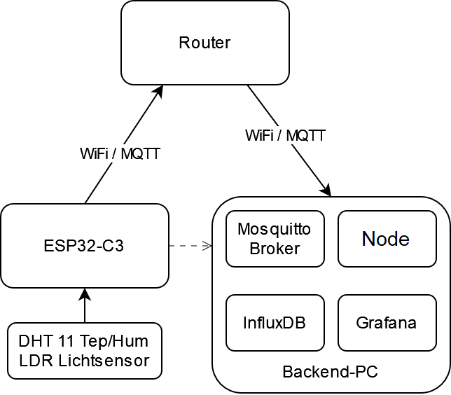
</div>

The system architecture is summarized below:

1. **ESP32-C3 Microcontroller**:
   - Reads data from the **DHT11 sensor** and **LDR**.
   - Publishes data to the MQTT broker.

2. **MQTT Broker**:
   - Receives data and forwards it to the backend.

3. **Backend**:
   - Processes the data using **Node.js**.
   - Stores the data in **InfluxDB**.

4. **Visualization**:
   - Displays data in real-time using **Grafana dashboards**.

---

# Setup 🛠️

This repository assumes that the DHT11 sensor and the built-in LDR are properly connected, that you know the respective pins they are connected to, and how to address them in the Arduino code.

## 1. Clone this repository 🧑‍💻:
   ```bash
   git clone https://github.com/yourusername/IoT-HomeSensor.git
   ```
## 2. Microcontroller Setup

#### 1. Download USB-Drivers for Microcontroller⬇️

- Download and install the USB-Drivers for the  **ESP32-C3 microcontroller**from [here](https://www.silabs.com/developer-tools/usb-to-uart-bridge-vcp-drivers?tab=downloads).
- Choose the right option for your operating system.
  
#### 2. Download Visual Studio Code and PlatformIO IDE Extension⬇️

- Download and install **Visual Studio Code (VS Code)** from [here](https://code.visualstudio.com/).
- Install the **PlatformIO IDE Extension** by searching for "PlatformIO" in the Extensions view of Visual Studio Code.

#### 3. Open the Arduino Folder in Visual Studio Code📂

- Open the `Arduino` folder located in the `IoT-Home-Sensor/Arduino` directory in Visual Studio Code.
- The PlatformIO extension should recognize the project immediately.

#### 4. Adjust the Code to Your Use-Case✍️

##### 6.1. Adjust Wi-Fi Name and Password
- Update the `ssid` and `password` with your own Wi-Fi network's SSID and password:
- Update the  `mqtt_server` IP address with the IP address of your broker
  
   ```cpp
   const char* ssid = "your_wifi_name";
   const char* password = "your_wifi_password";
   const char* mqtt_server = "192.168.0.51"; 
   ```

##### 6.2. Adjust Pin Numbers
- Adjust the pin numbers for the DHT11 sensor according to the pins you're using on your microcontroller.
  
  ```cpp
   // DHT Sensor Setup
  #define DHTPIN 10        // Adjust Pin where the DHT11 is connected
  #define DHTTYPE DHT11    // Adjust to Type of Sensor , in my case DHT 11
  DHT dht(DHTPIN, DHTTYPE);
   ```
- Don't forget to adjust the LDR too
  
   ```cpp
    const int gpioPin = GPIO_NUM_1; 
   ```


##### 6.3. Adjust the Location of the Chip in the Topic Name
- Update the topic name to include the location of your chip (for example, `home/livingroom/temp`).
  
  ```cpp
      // Names of the Topic being published to
      const char* temperture_topic="office/temperature";
      const char* humidity_topic="office/humidity";
      const char* light_topic="office/light";
  
  ```
#### 6.  Connect  ESP32-C3-devKitM-1 microcontroller via a USB micro cabel to your computer🔌
#### 7.  Build the code 💻
- Build the code by pressing the check mark at the bottom of Visual Studio Code.
- The console should pop up and start the gradle build.
- Wait until it says Success....✔️

<div align="center">
  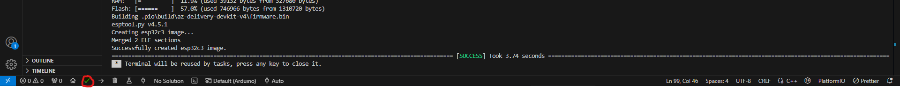
</div>

#### 7.  Flash Code unto ESP32-C3-devKitM-1 microcontroller⚡
- Flash/Upload the code by pressing the arrow mark

  <div align="center">
  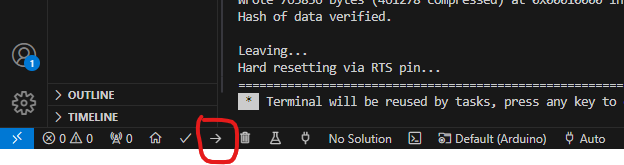
  </div>
  
#### 8. Watch the Code in Action 👷‍♂️
- Click on the Serial Monitor to see the Microcontroller running the code
  
  <div align="center">
  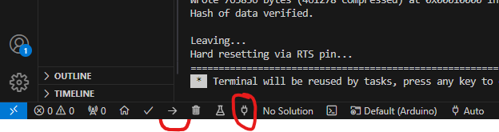
  </div>

## 3.  Backend Setup 🖥️

#### 1. Install Docker ⬇️
- Ensure Docker is installed on your system. You can download it from [here](https://www.docker.com/products/docker-desktop/).  
- Follow the installation steps for your operating system and ensure Docker is running.

#### 2. Open the NodeMQTT Folder 📂
- Navigate to the `IoT-HomeSensor` directory in Visual Studio Code.  
- Open the `NodeMQTT` folder:  

   ```bash
   cd NodeMQTT
   ```

#### 3. Build the Docker Image 📦
- Use the Dockerfile in the `NodeMQTT` folder to build an image of the Node.js project named **mqtt-influxdb-client**.  
- Run the following command in the VS Code terminal:  

   ```bash
   docker build -t mqtt-influxdb-client .
   ```

#### 4. Return to the IoT-HomeSensor Directory 🔄
- After building the image, navigate back to the main `IoT-HomeSensor` directory:  

   ```bash
   cd ..
   ```

#### 5. Adjust the Docker-Compose File ✍️
- In the `IoT-HomeSensor` directory, locate the `docker-compose.yaml` file.  
- This file contains environment variables for the InfluxDB and Grafana services. Adjust the passwords to your liking, but leave the bucket name if possible unchanged.
- Changing the bucket or Organisation Name , means you have to adjust for the node app in the file as well.
- environment values to optionally edit:  

   ```yaml
   MQTT_BROKER_URL: "mqtt://mosquitto" # Mosquitto broker URL

   
   INFLUX_URL: "http://influxdb2:8086" # InfluxDB URL
   DOCKER_INFLUXDB_INIT_MODE: setup
   DOCKER_INFLUXDB_INIT_USERNAME: admin # InfluxDB username
   DOCKER_INFLUXDB_INIT_PASSWORD: HTL22_"2025 # InfluxDB password
   DOCKER_INFLUXDB_INIT_ADMIN_TOKEN: HTL22_"2025 # InfluxDB admin token
   DOCKER_INFLUXDB_INIT_ORG: IotIsSimple # Organization name
   DOCKER_INFLUXDB_INIT_BUCKET: Iot-SysDev # Bucket name 
   INFLUX_TOKEN: HTL22_"2025 # InfluxDB token
   INFLUX_ORG: IotIsSimple # InfluxDB organization
   INFLUX_BUCKET: Iot-SysDev # InfluxDB bucket

   
   GF_SECURITY_ADMIN_PASSWORD: HTL22_"2025 # Grafana admin password
   ```

#### 6. Run Docker-Compose 🚀
- After editing the `docker-compose.yaml` file, run the following command in the `IoT-HomeSensor` directory to start the backend services:  

   ```bash
   docker-compose up
   ```

- The backend setup is now complete!

## Grafana Setup 📊

#### 1. Login at the `localhost:3001` or the port docker is using for  Grafana 

- Login by using the username admin and the password you defined in the docker-compose file under  GF_SECURITY_ADMIN_PASSWORD
  
   <div align="center">
  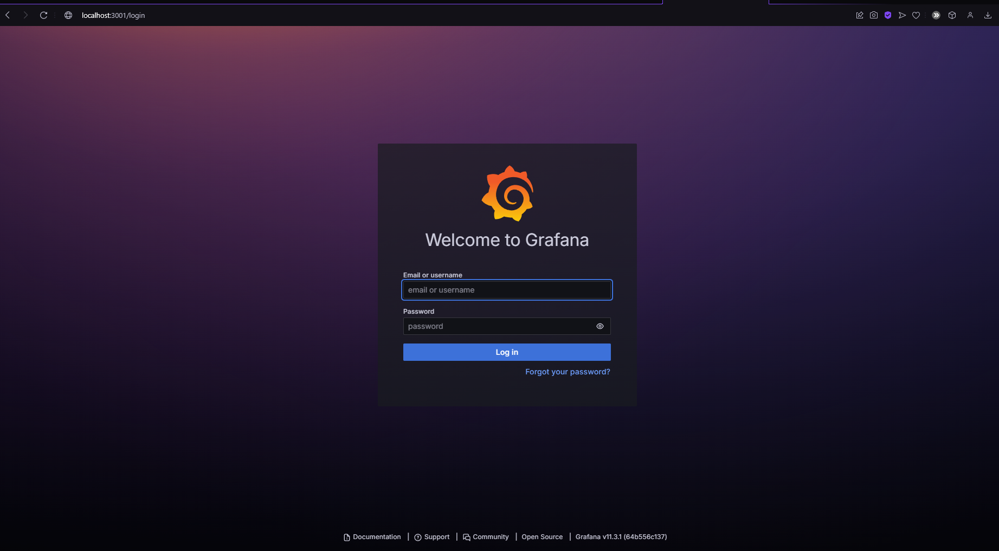
</div>

#### 2. Connect InfluxDB to Grafana as a Data Source

##### Step 1: Create a New Data Source
- Open Grafana and navigate to the **Connections section.
    <div align="center">
  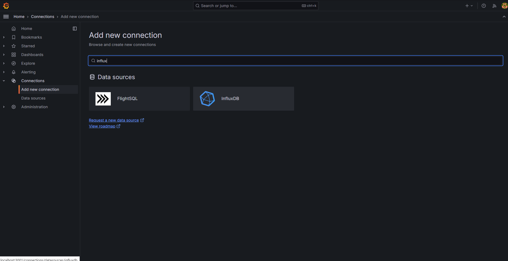
</div>

- Click **Add Data Source**.
- Select **InfluxDB** from the list.


<div align="center">
  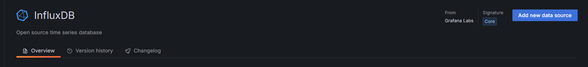
</div>

#### Step 2: Configure InfluxDB Connection
- In the configuration options, make the following adjustments:

1. **Change Database Language**  
   - Set the database language to **Flux** from **InfluxQL**.

<div align="center">
  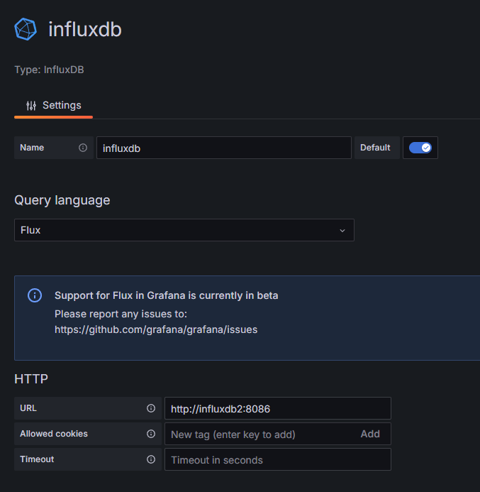
</div>

2. **Add InfluxDB URL**  
   - Use the InfluxDB URL from the `docker-compose.yaml` file (e.g., `http://influxdb2:8086`).

3. **Enable Basic Authentication**  
   - Turn on **Basic Auth** and provide the username and password:
     - Username: Use `admin` or the username you set in the `docker-compose.yaml` file.
     - Password: Use the password from the `docker-compose.yaml` file.

4. **Add Organization Name and Bucket Name**  
   - Organization Name: Use the value of `DOCKER_INFLUXDB_INIT_ORG` (default is `IotIsSimple`).
   - Default Bucket Name: Use the value of `DOCKER_INFLUXDB_INIT_BUCKET` (default is `Iot-SysDev`).


<div align="center">
  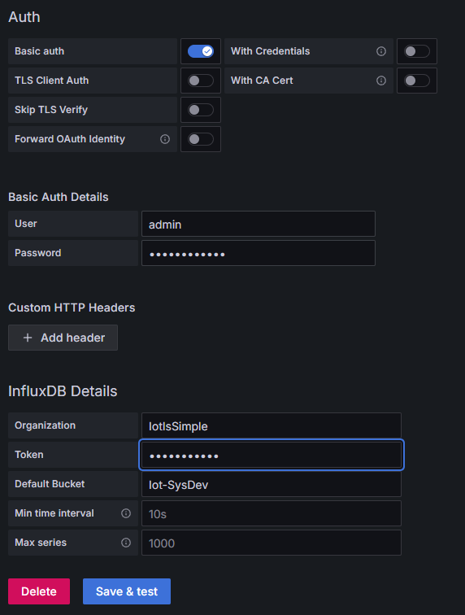
</div>

#### Step 3: Save and Test
- After entering the details, click **Save and Test** to verify the connection.

### 3. Create a New Dashboard

#### Step 1: Navigate to Dashboards
- Go to the **Dashboards** section and select **New Dashboard**.

<div align="center">
  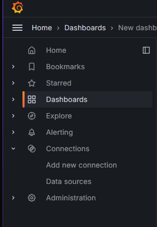
</div>

- Choose **Add a New Panel**.
<div align="center">
  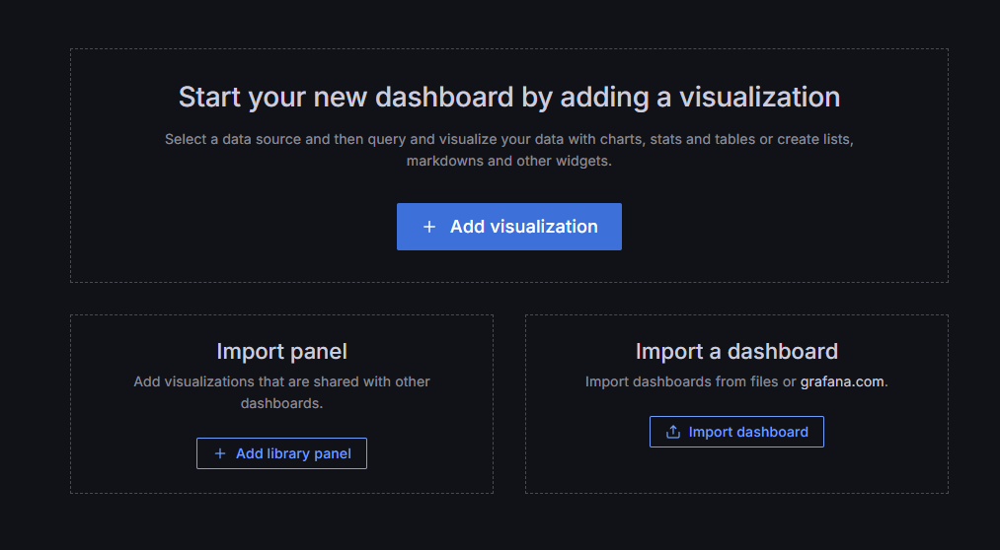
</div>


#### Step 2: Build Your Visualizations
- Now open the `localhost:8086` in another tap 
- Login in Influxdb via the  `DOCKER_INFLUXDB_INIT_USERNAME` and `DOCKER_INFLUXDB_INIT_PASSWORD` , you setup in the docker compose file
  
<div align="center">
  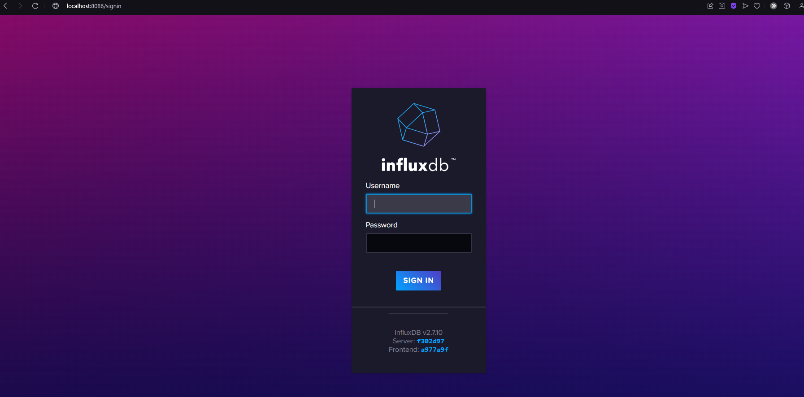
</div>


- Use the **Query Builder** to select and visualize data from the InfluxDB data source.

<div align="center">
  
</div>

#### Step 3: Create Graph and Gauge Panels
1. **Graph Panel**  
   - Create a graph to display light sensor data over time.
   - Use the query to fetch light sensor data from the bucket.

<div align="center">
  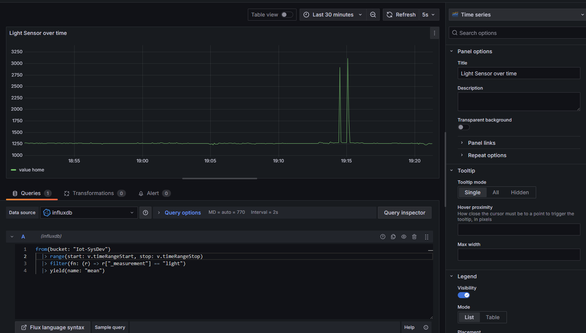
</div>

2. **Gauge Panel**  
   - Create a gauge to show the current light sensor value.
   - Similar queries can be used for temperature and humidity data.

<div align="center">
  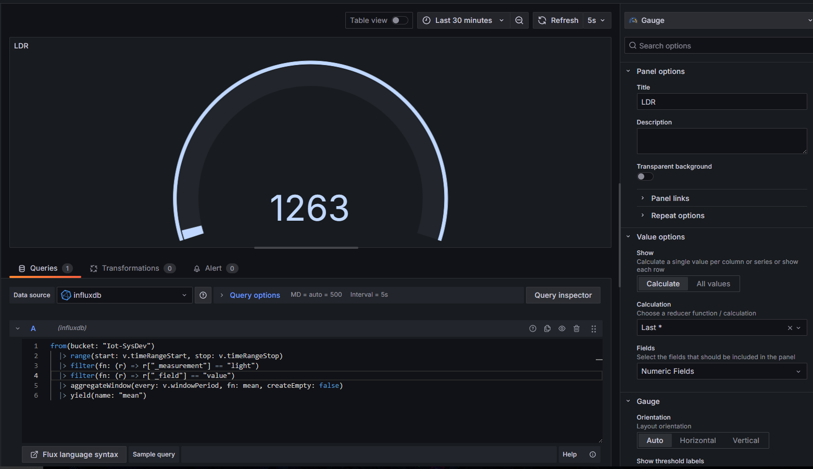
</div>

#### Step 4: Customize Your Dashboard
- You can create as many visualizations as you like to suit your needs.
- Use graphs, gauges, tables, and more to display data from your sensors.
- Example:
<div align="center">
  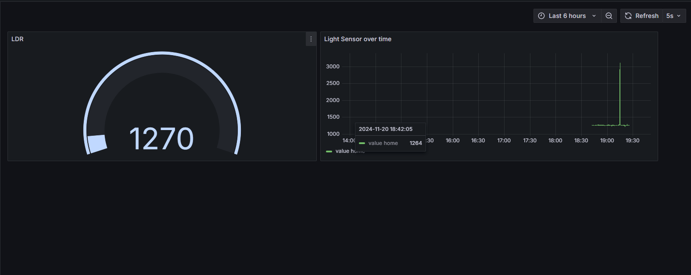
</div>

## Your Dashboard is Ready! 🎉
  
