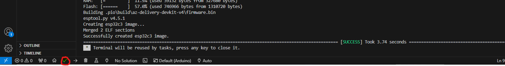

# IoT Home Sensor 🌐

An IoT-based home monitoring system using the **ESP32-C3 microcontroller** equipped with:

- A **DHT11 sensor** for measuring temperature and humidity.
- A **built-in LDR** (light-dependent resistor) for monitoring ambient light levels.

The data is transmitted via **MQTT** to a backend running in **Docker**, with:

- **Node.js** for processing and routing data.
- **InfluxDB** for storing time-series data.
- **Grafana** for real-time visualization.

This system is **efficient**, **scalable**, and **easy to deploy**, making it perfect for smart home enthusiasts or IoT developers.

---

## Features 🚀

### Hardware:
- **ESP32-C3 microcontroller**: Low-power, Wi-Fi-enabled microcontroller.
- **DHT11 sensor**: Reliable temperature and humidity monitoring.
- **Built-in LDR**: Measures ambient light intensity.

### Communication:
- Lightweight **MQTT protocol** for efficient data transfer.

### Backend:
- **Node.js**: Processes sensor data and routes it to the database.
- **InfluxDB**: Stores time-series data for easy querying and visualization.
- **Grafana**: User-friendly dashboard for real-time insights.

### Scalability:
- Supports adding more sensors or devices as needed.

### Cross-platform Deployment:
- Runs in a **Dockerized environment** for easy setup and portability.

---

## System Architecture 🏗️

<div align="center">
  
</div>

The system architecture is summarized below:

1. **ESP32-C3 Microcontroller**:
   - Reads data from the **DHT11 sensor** and **LDR**.
   - Publishes data to the MQTT broker.

2. **MQTT Broker**:
   - Receives data and forwards it to the backend.

3. **Backend**:
   - Processes the data using **Node.js**.
   - Stores the data in **InfluxDB**.

4. **Visualization**:
   - Displays data in real-time using **Grafana dashboards**.

---

# Setup 🛠️

This repository assumes that the DHT11 sensor and the built-in LDR are properly connected, that you know the respective pins they are connected to, and how to address them in the Arduino code.

### 1. Clone this repository 🧑‍💻:
   ```bash
   git clone https://github.com/yourusername/IoT-HomeSensor.git
   ```
### 2. Download USB-Drivers for Microcontroller⬇️

- Download and install the USB-Drivers for the  **ESP32-C3 microcontroller**from [here](https://www.silabs.com/developer-tools/usb-to-uart-bridge-vcp-drivers?tab=downloads).
- Choose the right option for your operating system.
  
### 3. Download Visual Studio Code and PlatformIO IDE Extension⬇️

- Download and install **Visual Studio Code (VS Code)** from [here](https://code.visualstudio.com/).
- Install the **PlatformIO IDE Extension** by searching for "PlatformIO" in the Extensions view of Visual Studio Code.

### 4. Open the Arduino Folder in Visual Studio Code📂

- Open the `Arduino` folder located in the `IoT-Home-Sensor/Arduino` directory in Visual Studio Code.
- The PlatformIO extension should recognize the project immediately.

### 5. Adjust the Code to Your Use-Case✍️

#### 5.1. Adjust Wi-Fi Name and Password
- Update the `ssid` and `password` with your own Wi-Fi network's SSID and password:
- Update the  `mqtt_server` IP address with the IP address of your broker
  
   ```cpp
   const char* ssid = "your_wifi_name";
   const char* password = "your_wifi_password";
   const char* mqtt_server = "192.168.0.51"; 
   ```

#### 5.2. Adjust Pin Numbers
- Adjust the pin numbers for the DHT11 sensor according to the pins you're using on your microcontroller.
  
  ```cpp
   // DHT Sensor Setup
  #define DHTPIN 10        // Adjust Pin where the DHT11 is connected
  #define DHTTYPE DHT11    // Adjust to Type of Sensor , in my case DHT 11
  DHT dht(DHTPIN, DHTTYPE);
   ```
- Don't forget to adjust the LDR too
  
   ```cpp
    const int gpioPin = GPIO_NUM_1; 
   ```


#### 5.3. Adjust the Location of the Chip in the Topic Name
- Update the topic name to include the location of your chip (for example, `home/livingroom/temp`).
  
  ```cpp
      // Names of the Topic being published to
      const char* temperture_topic="office/temperature";
      const char* humidity_topic="office/humidity";
      const char* light_topic="office/light";
  
  ```
### 6.  Connect  ESP32-C3-devKitM-1 microcontroller via a USB micro cabel to your computer🔌
### 7.  Build the code 💻
- Build the code by pressing the check mark at the bottom of Visual Studio Code.
- The console should pop up and start the gradle build.
- Wait until it says Success....✔️

<div align="center">
  
</div>

### 7.  Flash Code unto ESP32-C3-devKitM-1 microcontroller⚡
- Flash/Upload the code by pressing the arrow mark

  <div align="center">
  
  </div>
  
### 8. Watch the Code in Action 👷‍♂️
- Click on the Serial Monitor to see the Microcontroller running the code
  
  <div align="center">
  
  </div>
  
